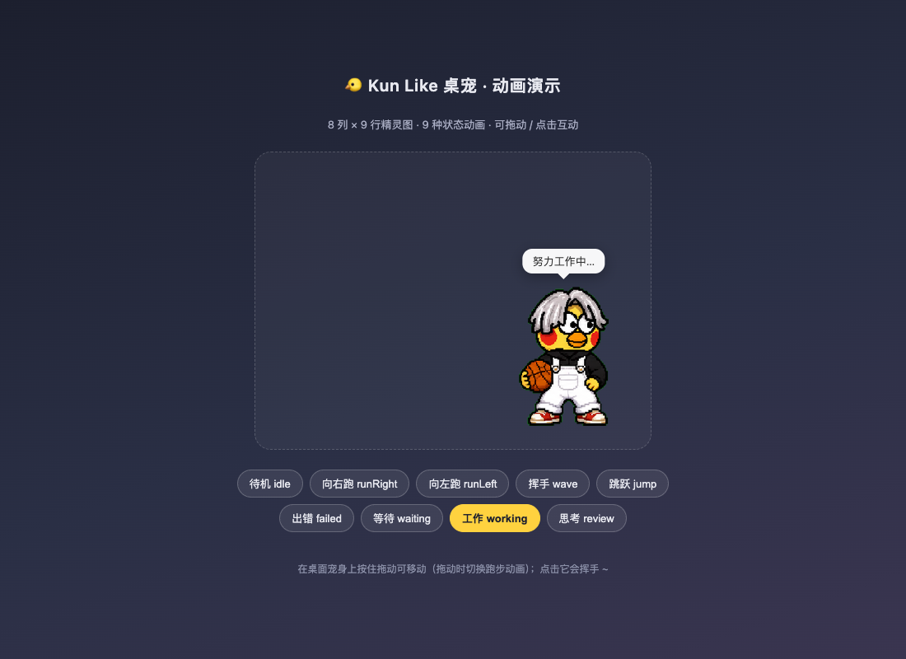
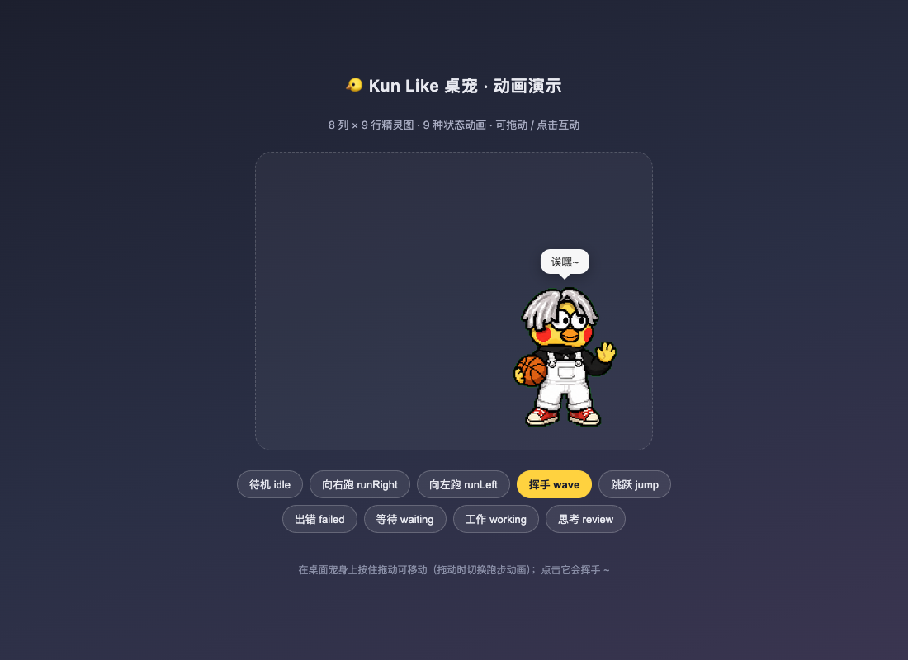

# 🐤 Kun Like 桌宠

> **原作者 / 上游项目：[liyupi/dsh-kun-like-pet](https://github.com/liyupi/dsh-kun-like-pet)**
> 本仓库在其基础上扩展了系统级悬浮窗版本（WPF 透明置顶窗口，悬浮在所有应用之上）。

> DeepSeek Harness（DSH）桌面宠物 —— 一只**悬浮在所有窗口之上**的小坤宠。
> 它会盯着 Agent 干活：你搓代码时它努力搬砖，你思考时它托腮，等你回复时它翘首以盼，任务完成时它挥手跳跃、大喊 **「你干嘛~哎哟」** 🏀





## ✨ 特性

- **系统级悬浮窗**：WPF 透明置顶窗口，悬浮在 Windows 所有应用程序之上（不止浏览器），可拖到任意屏幕位置
- **9 种状态动画**：完全沿用 Codex 桌宠精灵图契约（8 列 × 9 行、每格 192×208），素材零重绘
- **实时感知 Agent 状态**：轮询 `agents` 服务感知每个 Agent 的 running/idle 状态，配合 `tools/execute`、`approval/request`、`agent/request-error` 事件推导工作 / 思考 / 等待 / 出错 / 空闲五种模式
- **任务完成全机可闻**：宿主进程用系统命令播放「你干嘛~哎哟」，任何窗口、任何会话完成任务都会响，与浏览器静音无关
- **可互动**：拖动桌宠到处跑（跑步动画方向跟随，1:1 跟手），点击它挥手打招呼 + 播放语音，右键退出
- **内置调试工具**：`kun_pet_debug` 查看状态机内部计数；`kun_pet_window` 控制悬浮窗启停

## 🎮 状态 → 动作映射

| Agent 工作状态 | 桌宠动作 | 气泡文案 |
| --- | --- | --- |
| 工作中（有工具在执行） | 专注干活（第 7 行） | 努力工作中… |
| 回合中但空闲 | 思考循环（第 8 行） | 思考中… |
| 等待用户回复 / 审批 | 期待等待（第 6 行） | 在等你回复哦~ |
| 出错 | 难过低落（第 5 行） | 呜…出错了 (._.) |
| 空闲 | 呼吸待机（第 0 行） | 休息中~ 有事叫我 |
| **任务完成** | 挥手 + 跳跃庆祝（第 3/4 行交替）＋ 系统音「你干嘛~哎哟」 | 完成啦！你干嘛~哎哟 |
| 拖动 | 跑步（第 1/2 行，方向跟随） | 呜哇~ 别拽我！ |
| 点击 | 挥手（2.4s 反应）+ 语音 | 诶嘿~ |

## 🚀 安装

> ⚠️ **安装提醒：安装本插件时，请选择「创造模式」。**

### 方式一：系统级悬浮窗（推荐，已实测）

1. 克隆本仓库：

   ```bash
   git clone https://github.com/<your-name>/kun-like-pet.git
   ```

2. 在 DSH 会话中把 `kunpet-desktop.package.json` 交给 `cordis_define`（或让 Agent 读取该文件执行）：

   - `plugin` / `name` / `purpose` / `code` 四个字段原样传给 `cordis_define`
   - 用返回的 `pluginId` / `packageId` 调用 `cordis_run`（mode=`run`）

3. 宿主插件会自动拉起 `desktop/kunpet-desktop.ps1`（WPF 透明置顶悬浮窗），通过 `/kun-pet/state` 同步状态机。悬浮窗：

   - 🖱️ 拖动：跑步动画跟随（1:1 跟手）
   - 👆 点击：挥手 + 播放「你干嘛~哎哟」
   - 🖱️ 右键：菜单退出
   - 也可用 `kun_pet_window` 工具（start/stop/status）控制

> **平台注意（Windows）**
>
> - 宿主 shell 服务按 `sandboxPolicy` 工作：默认 workspace（`C:/Users/<user>`）包含系统 TEMP，`windows-acl-run` 会拒绝执行。本版本已为所有 shell 命令显式传入 `sandboxPolicy`（`danger-full-access` / `workspace-write`，workspace 指向会话工作区）。
> - 受限沙箱令牌会移除 INTERACTIVE SID，导致音频端点被拒（点击/庆祝语音无声），因此悬浮窗进程与语音播放命令使用 `danger-full-access`。
> - 精灵图使用 `assets/spritesheet-clean.png`：原始 `spritesheet.webp` 的 alpha 通道在转码中丢失（黑底 + 绿幕毛边），clean 版已做透明化与绿边清除。
> - 宿主 shell 服务会吞掉命令字符串中的 `$` 变量，因此语音播放逻辑必须放在 `desktop/play-voice.ps1` 脚本文件中，`playCommand` 以 `-File` 方式调用。
> - 庆祝语音必须用 `shell.start` 后台启动播放——实测 `shell.run` 前台路径静音（同一脚本、同一会话、桌面/音频设备均正常）。
> - macOS / Linux 需把 `CONFIG.playCommand` 换成对应播放命令（afplay / ffplay）。

### 方式二：DSH 网页版桌宠（早期版本）

网页内嵌桌宠以 **DSH 动态插件** 形式开发并运行验证（`cordis_define`）。`src/host.js` + `src/client.js` 为插件 Host/Client 两半源码：

1. 修改 `src/host.js` 顶部 `CONFIG` 中的素材路径
2. 生成一键安装载荷并粘贴给 `cordis_define` 工具：

   ```bash
   node scripts/build-kunpet-package.mjs -   # 输出 JSON 载荷
   ```

3. 用 `cordis_run` 激活，Web 界面右下角即出现桌宠。

### 方式三：直接预览动画（无需 DSH）

打开 `demo/index.html`（建议起个静态服务器，如 `npx serve .` 或 `python3 -m http.server`），即可查看全部 9 种动画并拖动互动。

## ⚙️ 配置

所有可调项集中在 `kunpet-desktop.package.json` 的 `code.host` 顶部 `CONFIG`：

| 配置 | 默认值 | 说明 |
| --- | --- | --- |
| `spritePath` | `D:/KUN_pet/kunpet-sprite.png` | 精灵图路径（clean 版 PNG） |
| `voicePath` | `…/assets/voice.mp3` | 完成音路径 |
| `playCommand` | `powershell -File desktop/play-voice.ps1`（Windows） | 系统级播放命令（macOS：`afplay`；Linux：`ffplay -nodisp -autoexit`） |
| `desktopScriptPath` | `…/desktop/kunpet-desktop.ps1` | 悬浮窗脚本路径 |
| `pollMs` | `500` | Agent 状态轮询间隔 |
| `celebrateMs` | `4800` | 庆祝动画时长 |
| `failedMs` | `2600` | 失败动画时长 |

## 📁 项目结构

```
kun-like-pet/
├── src/
│   ├── host.js        # 网页版插件 Host 半（早期版本）
│   └── client.js      # 网页版插件 Client 半（早期版本）
├── desktop/
│   ├── kunpet-desktop.ps1   # 系统级 WPF 透明置顶悬浮窗（当前主力）
│   └── play-voice.ps1       # 系统级语音播放（WMP COM / MCI，宿主调用）
├── assets/
│   ├── spritesheet.webp         # 原始 8×9 精灵图（alpha 已丢失，仅存档）
│   ├── spritesheet-clean.png    # 清理后的精灵图（透明背景、绿边已除，当前使用）
│   └── voice.mp3                # 「你干嘛~哎哟」完成音
├── demo/index.html    # 独立动画演示页（无需 DSH）
├── docs/
│   ├── SPRITESHEET-CONTRACT.md   # 精灵图契约与动画行速查
│   └── screenshots…
├── scripts/
│   ├── build-kunpet-package.mjs  # 生成 cordis_define 安装载荷
│   └── validate.mjs              # 仓库完整性校验
├── CHANGELOG.md       # 迭代记录（含事件隔离根因分析）
├── kunpet.package.json            # 网页版一键安装载荷（早期版本）
└── kunpet-desktop.package.json    # 系统级悬浮窗一键安装载荷（最终版）
```

校验：`node scripts/validate.mjs`

## ❓ 常见问题

**桌宠只在某一个窗口里？**
网页版（`src/client.js`）只注入到激活它的会话页面。系统级悬浮窗（`desktop/kunpet-desktop.ps1`）通过 WPF 透明置顶窗口悬浮在**所有窗口之上**，解决该问题。

**悬浮窗动画/渲染踩坑记录**
WPF 渲染管线有三个坑（均已修复并注释在脚本中）：`Clip` 会跟随 `RenderTransform` 移动（裁剪窗口必须放在不动的父容器上）；`Image` 元素会把内容裁剪到自身盒子（元素须按完整精灵图尺寸放置）；拖动用窗口内相对坐标会形成反馈环（全程改用 Win32 物理像素：`GetCursorPos` + `SetWindowPos`）。

**为什么不用事件监听而要轮询？**
开发过程中用 `internal/dispatch` 探针实证发现：部分部署里 `agent/status`、`agent/turn-stopping` 等 Agent 状态事件不流经动态插件所在总线（831 次事件观测中 status 类事件为 0），事件监听永远等不到「任务完成」。轮询 `agents` 服务是最可靠的跨部署方案。详见 [CHANGELOG](CHANGELOG.md) v3/v4。

## ⚠️ 素材版权声明

- `assets/voice.mp3` 为网络公开的二创梗语音片段（含公众人物声音），版权归原作者所有，**仅供个人学习交流使用**，请勿用于商业用途；如需商用请自行替换为无版权素材。
- `assets/spritesheet.webp` / `assets/spritesheet-clean.png` 为粉丝二创像素形象，沿用 Codex 桌宠素材契约制作。
- 若您是权利人且不希望相关内容被展示，请联系删除。

## 📄 License

代码以 [MIT License](LICENSE) 开源。素材文件（`assets/`）仅限个人学习交流，遵循上一条声明。
